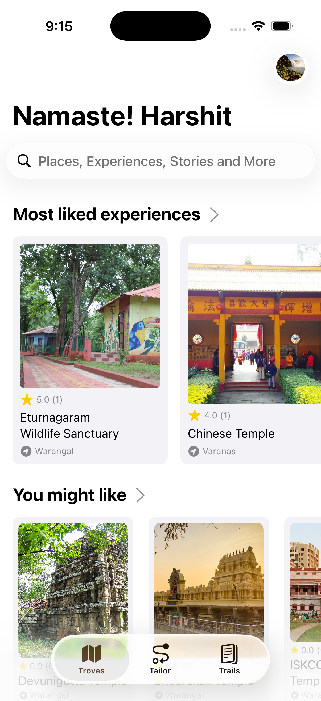
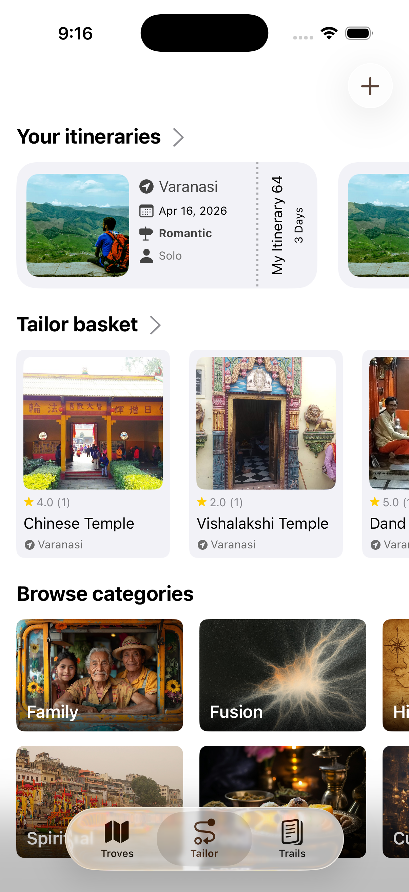
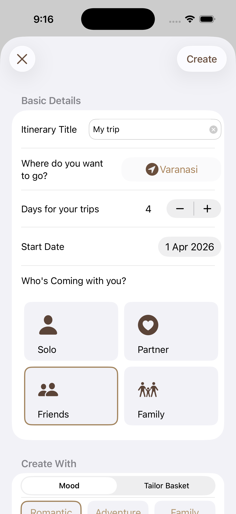
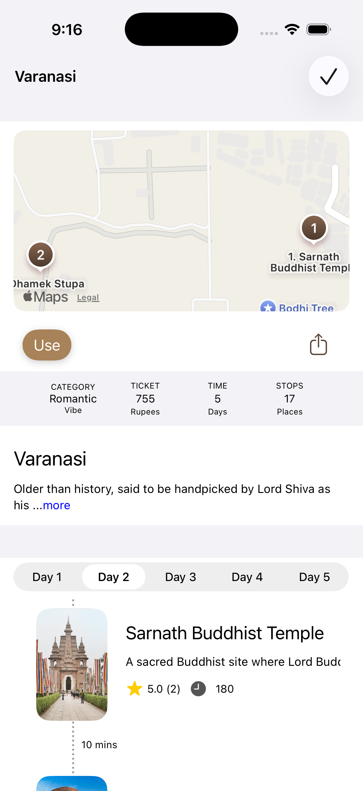
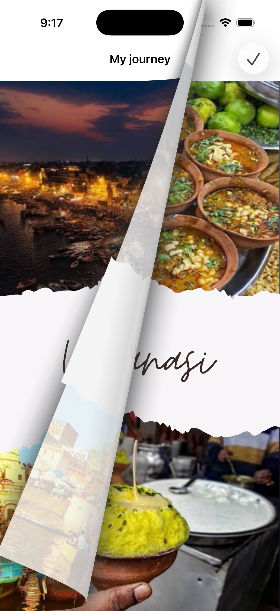

# 🌍 YatraMitr: Travel India Smart  
**Plan better trips. Travel thoughtfully.**

Travel isn’t just about places. It’s about understanding them.  
That’s exactly what **YatraMitr** is built for.

---

## ✨ What is YatraMitr?

**YatraMitr** is your smart travel companion that helps you **explore, plan, and preserve journeys**—all in one seamless experience.

Whether you're:
- Planning a weekend getaway  
- Exploring hidden gems  
- Or documenting your travel story  

YatraMitr makes every trip more meaningful.

---

## 🚀 Features

### 🧭 Troves – Discover More
- Discover **unique, offbeat experiences** beyond typical tourist spots  
- Explore destinations with **real cultural and contextual insights**

### 🧠 Tailor – Smart Itineraries
- AI-generated travel plans based on your **preferences & travel vibe**  
- Personalized recommendations for smarter trip planning  

### 📸 Trails – Capture Memories
- Create a **clean, aesthetic photo journal** of your journeys  
- Organize and revisit your memories anytime  

### ⚡ Seamless Experience
From **discover → plan → capture**, everything flows effortlessly.

---

## 📌 Why YatraMitr?

> *“Travel isn’t just about where you go, but how deeply you experience it.”*

YatraMitr helps you:
- Travel with **purpose**
- Explore with **context**
- Preserve memories with **clarity**

---

## 📱 Download the App  
👉 https://apps.apple.com/us/app/yatramitr-travel-india-smart/id6746633565

---

## 🖼️ App Preview  

  
  
  
   
  

---

## 🛠 Tech Stack

- **Language:** Swift  
- **Frameworks:** SwiftUI, UIKit  
- **Tools & APIs:** MapKit, Xcode, PDFkit

---

## 👥 Built With ❤️ By

- Abhinav Gupta  
- Aditya Mathur
- Astha Arora
- Harshit Gupta  

---

## 🙌 Feedback & Suggestions

We’d love to hear from you!

- Open an issue  
- Share your feedback  
